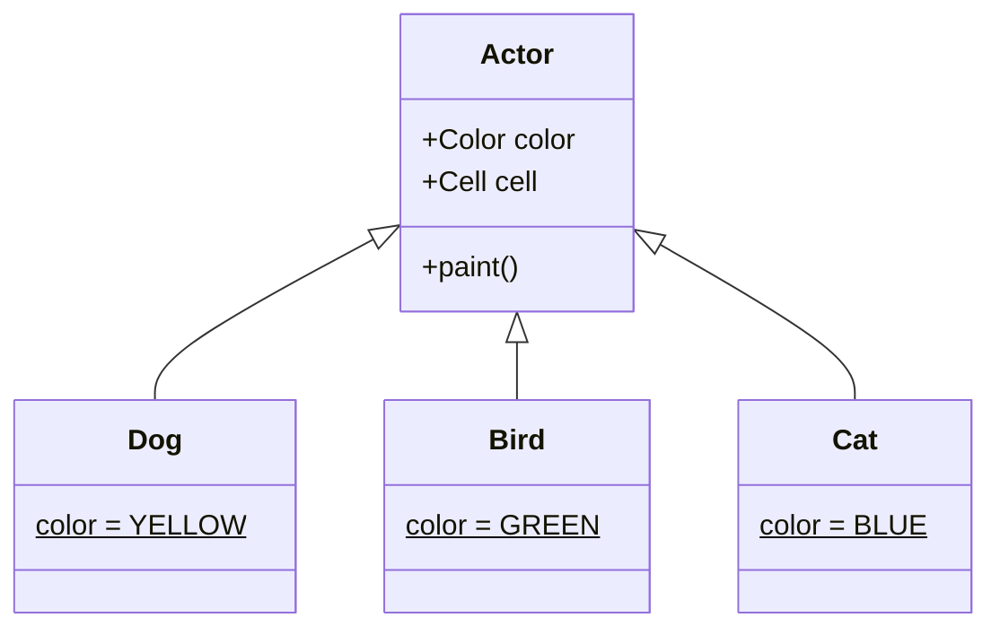

# Task 9

```mermaid 
classDiagram
    Actor <|-- Dog
    Actor <|-- Bird
    Actor <|-- Cat
    Actor : +Color color
    Actor : +Cell cell
    Actor : +paint()

    class Dog{
        color = YELLOW$
    }

    class Bird{
        color = GREEN$
    }

    class Cat{
        color = BLUE$
    }
```